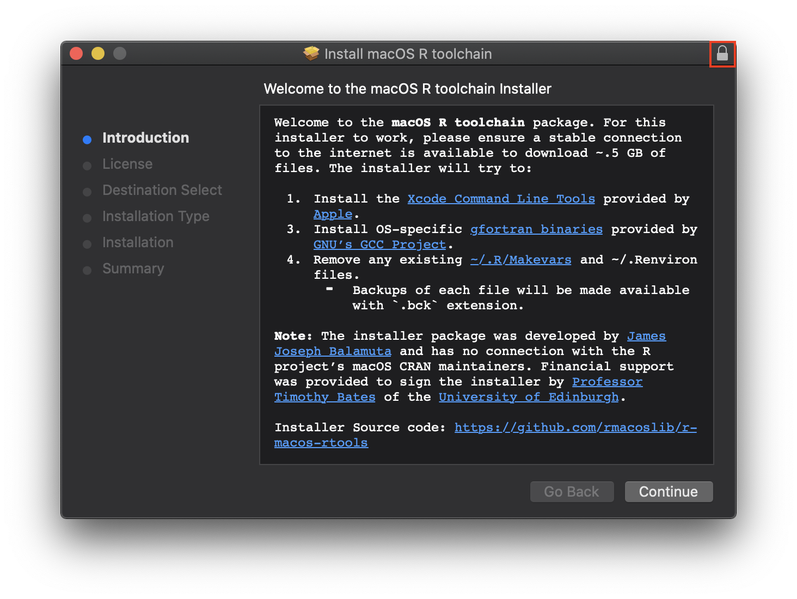
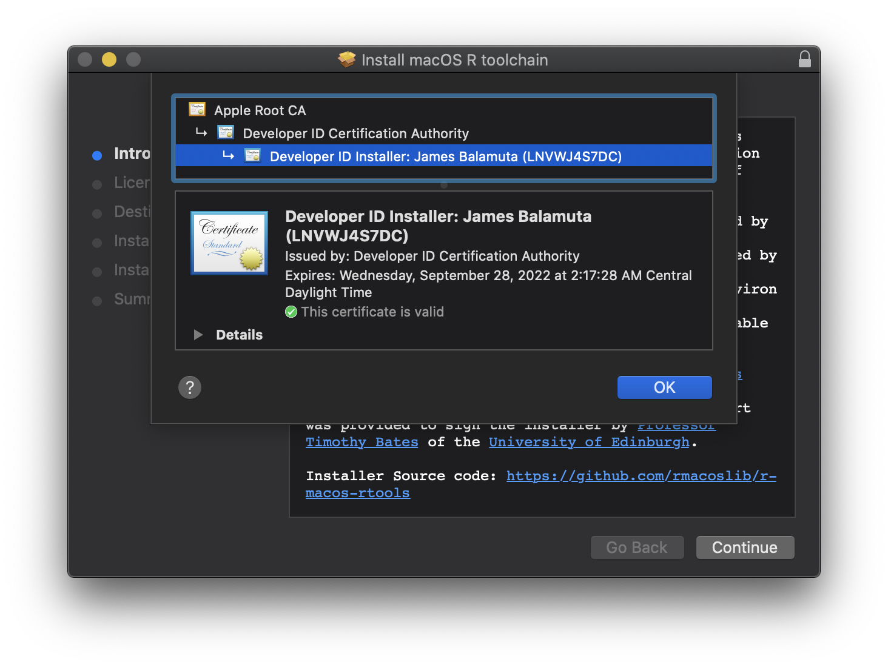

# Installer Package for macOS _R_ toolchain 

The repository contains the scripts used to create an installer package (.pkg)
that contains binaries used to create the CRAN official macOS _R_ binary. 
Specifically, the installer will try to download and install:

- Xcode command line tools (XCode CLI) from Apple
- `clang7` from <https://cran.r-project.org/bin/macosx/tools/>
- `gfortran6.1` from <https://cran.r-project.org/bin/macosx/tools/>

Aftwards, it will attempt to configure the necessary `~/.R/Makevars` and `~/.Renviron` files.
If either file is pre-existing, then a backup will be made prior to setting up the new versions. 

For those interested, the installer can be obtained
on either the project's [**release page**](https://github.com/rmacoslib/r-macos-rtools/releases/latest)
or through <http://go.illinois.edu/r-macos-rtools-pkg>. The pre-built binaries this
installer encloses can be found at <https://developer.apple.com/download/more/>,
<https://cran.r-project.org/bin/macosx/tools/>, and <https://gcc.gnu.org/wiki/GFortranBinaries#MacOS-1>. 

**Note** The installer package was developed by [James Joseph Balamuta](https://thecoatlessprofessor.com)
and has no connection with the R project’s macOS CRAN maintainers. 
Financial support was provided to sign the installer by 
[Professor Timothy Bates](http://www.ed.ac.uk/profile/timothy-bates) 
of the [University of Edinburgh](http://www.ed.ac.uk/).

## How do I use the installer?

1. Download it from the project's [**release page**](https://github.com/rmacoslib/r-macos-rtools/releases/latest)
   or through <http://go.illinois.edu/r-macos-rtools-pkg>.
2. Open the installer by either double click or right clicking to bring up menu and selecting "Open".
3. From here, navigate through it like a normal macOS installer.

**That's it.**

Once installed, you can start using compiled code
in _R_ like normal with the added benefit of `OpenMP`.

If you want to see behind the curtain, continue reading...

## What does the installer do?

The macOS _R_ toolchain installer performs four actions that require
the user's password to accomplish. These actions are:

1. download and install XCode CLI via secure Apple product update
1. download, verify, and install the `clang7` pre-made binary 
   files into the `/usr/local/clang7` directory
1. download, verify, and install `gfortran6.1`
1. establish the proper header files in `CFLAGS`, `CPPFLAGS`, and `CXXFLAGS` in the `~/.R/Makevars` file
1. add to the `PATH` variable where the `clang7` binary is by using `~/.Renviron`

**Note:** The installer will replace existing `~/.R/Makevars` and `~/.Renviron` files. 
The existing files will be copied to a backup file, e.g. `~/.R/Makevars.bck` and `~/.Renvion.bck`.
Re-running the installer _will_ result in the old backup files being wiped.

Verify steps are conducted using embedded md5 hashes of the files.
If the hash is not identical to what was embedded, the installer will
exit. For details as to how this was implemented please see
[Issue 8: Verify pkg hash](https://github.com/coatless/r-macos-rtools/issues/8)
and the 
[Pull Request 10: Feature Pkg Hash Verification](https://github.com/coatless/r-macos-rtools/pull/10).

## Verify the Installer

Thanks to the **financial support provided by [Professor Timothy Bates](http://www.ed.ac.uk/profile/timothy-bates) of
the [University of Edinburgh](http://www.ed.ac.uk/)** to join the [Apple Developer program](https://developer.apple.com/).
The installer is now signed using [developer credentials](https://developer.apple.com/library/content/documentation/IDEs/Conceptual/AppDistributionGuide/MaintainingCertificates/MaintainingCertificates.html).

As a result, the installer should have a "lock" icon in the upper right corner:

Clicking the lock icon will reveal the signed developer certificate:

With this being said, the code used to generate the installer has been made publically available under an open source license (GPL >= 2). 

## Overview of Files

Below is an abridged version of the actions of each file provided.

- `scripts/postinstall`
   - Downloads and Installs Xcode CLI, `clang7`, and `gfortran6.1`
      - Detects the appropriate `Command Line Tools` dmg installer
	    by using a [headless cli check](https://github.com/timsutton/osx-vm-templates/blob/ce8df8a7468faa7c5312444ece1b977c1b2f77a4/scripts/xcode-cli-tools.sh#L8-L14),
		downloads the installer from <https://developer.apple.com/download/more/>,
		and installs it using `softwareupdate`.
      - Downloads the `clang-7.0.0.pkg` from
       <https://cran.r-project.org/bin/macosx/tools/> and installs it into `/` directory
	    so that it is installed on `/usr/local/clang7`
      - Downloads the gfortran binary 6.1 from 
        <https://cran.r-project.org/bin/macosx/tools/gfortran-6.1.pkg>, and 
        and installs it into `/usr/local/gfortran`.
   - Create the `~/.R/Makevars` file with the necessary implicit variables
     to compile using the new header location.
	   - `CFLAGS`, `CPPFLAGS`, `CXXFLAGS` for `clang7`
   - Make the `~/.Renviron` file with a modified `PATH` variable to the location of `clang7`.
   - **Note:** Pre-existing `~/.R/Makevars` and `~/.Renviron` files will be backed up prior to being overridden. 
- `make_installer.sh`
   - Create the installer package R binary installer `.pkg`
      - Builds the package from the extracted tar using `pkgbuild` 
      - Analyzing the package using `productbuild` to create a `distribution.xml`   
	  - Inserts customizations into the `distribution.xml` (title, background, ...)
	  - Calls `productbuild` to rebuild the package.
- `distribution.xml`
   - Customization options (e.g. title, background) of installer built by analyzing a temporary .pkg
- `build_files/Rlogo.png`
   - R logo
- `build_files/LICENSE.rtf`
   - License of the Xcode CLI, LLVM installer, and gfortran
- `build_files/WELCOME_DISPLAY.rtf`
   - Text displayed on welcome screen

# License

GPL (>= 2) 
